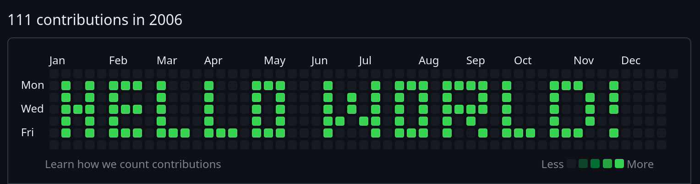

# Writing to the Contribution Graph



This guide will show you how to write text onto the contribution graph. In this example, I will push "Hello World!" into the year of my birth.
## Text Matrix
The simplest way to represent the contribution graph in code is with a 2D array. I'm going to write it out by hand because automating it would probably take me longer. If you want to draw more complex sentences and have a bit of free time, feel free to write a tool for this. The programming language you want to use really does not matter. I am going to use JavaScript out of convenience.


```js
const data = [
    [0, 0, 0, 0, 0, 0, 0, 0, 0, 0, 0, 0, 0, 0, 0, 0, 0, 0, 0, 0, 0, 0, 0, 0, 0, 0, 0, 0, 0, 0, 0, 0, 0, 0, 0, 0, 0, 0, 0, 0, 0, 0, 0, 0, 0, 0, 0],
    [1, 0, 1, 0, 1, 1, 1, 0, 1, 0, 0, 0, 1, 0, 0, 0, 1, 1, 1, 0, 0, 0, 1, 0, 0, 0, 1, 0, 1, 1, 1, 0, 1, 1, 1, 1, 0, 1, 0, 0, 0, 1, 1, 1, 0, 0, 1],
    [1, 0, 1, 0, 1, 0, 0, 0, 1, 0, 0, 0, 1, 0, 0, 0, 1, 0, 1, 0, 0, 0, 1, 0, 1, 0, 1, 0, 1, 0, 1, 0, 1, 0, 0, 1, 0, 1, 0, 0, 0, 1, 0, 0, 1, 0, 1],
    [1, 1, 1, 0, 1, 1, 1, 0, 1, 0, 0, 0, 1, 0, 0, 0, 1, 0, 1, 0, 0, 0, 1, 0, 1, 0, 1, 0, 1, 0, 1, 0, 1, 1, 1, 1, 0, 1, 0, 0, 0, 1, 0, 0, 1, 0, 1],
    [1, 0, 1, 0, 1, 0, 0, 0, 1, 0, 0, 0, 1, 0, 0, 0, 1, 0, 1, 0, 0, 0, 1, 1, 0, 1, 1, 0, 1, 0, 1, 0, 1, 0, 1, 0, 0, 1, 0, 0, 0, 1, 0, 0, 1, 0, 0],
    [1, 0, 1, 0, 1, 1, 1, 0, 1, 1, 1, 0, 1, 1, 1, 0, 1, 1, 1, 0, 0, 0, 1, 0, 0, 0, 1, 0, 1, 1, 1, 0, 1, 0, 0, 1, 0, 1, 1, 1, 0, 1, 1, 1, 0, 0, 1],
    [0, 0, 0, 0, 0, 0, 0, 0, 0, 0, 0, 0, 0, 0, 0, 0, 0, 0, 0, 0, 0, 0, 0, 0, 0, 0, 0, 0, 0, 0, 0, 0, 0, 0, 0, 0, 0, 0, 0, 0, 0, 0, 0, 0, 0, 0, 0],
];

//1: Green
//0: Gray
```

## Coloring the squares
To color one square, you need to create a commit on that date. 
To create a commit, you will need a local repository that can be imported later. 
By amending a commit like this, we can pretend that it was created in the past:

```
$ GIT_COMMITTER_DATE="Thu Jan 1 12:00 1970" \
  git commit --date="Thu Jan 1 12:00 1970" \
  --no-edit --allow-empty -m "Hello World!"`
```

Create a local repository:
```
$ mkdir funny-profile
$ git init
```

## Pushing the Text
Now, we can write a script that loops through the 2D Array and pushes a commit for that date. To find out the current date at one square, we will need to know the date where the text should be placed. I am going to use the 8th of January 2006. Because the date was the Sunday of the first week of the year, my 2D array can be perfectly placed at it. I am not going to take the 1st to get a little bit of padding.


### The Script
It is finally time to code. Create some sort of date to start with. I adjusted mine by two hours because of my local timezone.

```js
const startDate = new Date("9 Jan 2006 02:00:0")
```

Now we need to loop through every column. With every square, increment your date by one.


```js
for (let i = 0; i < data[0].length; i++) {
    for (let j = 0; j < data.length; j++) {
        startDate.setDate(startDate.getDate() + 1)
    }
}
```

Before incrementing the date, get the current square, detect if you should commit, and generate the command from earlier.

```js
//[...]
        const value = data[j][i]

        if (value === 1) {
            const commandString = `GIT_COMMITTER_DATE="${startDate.toISOString()}" `
                + `git commit --date="${startDate.toISOString()}" `
                + `--no-edit --allow-empty -m "Hello World!"`
            console.log(commandString)
        }

        startDate.setDate(startDate.getDate() + 1)
//[...]
```

Running this will output a lot of commands. Just copy all of them and paste them into a terminal with your local git repository from earlier opened.

### Importing the repository
Now, create a new repository on your code sharing platform of choice and copy its URL. Push the changes using this command:

```
$ git remote add origin <your-repo-url>
$ git branch -M main # you can also use master or something else
$ git push -u origin main # you can also use master or something else
```

## HELP: Something did not work, the graph looks horrible
If you want to retry, you can create an orphan branch to get rid of all the existing commits.

```
$ git checkout --orphan=clean

Do your thing and add a remote...

$ git branch -m main # you can also use master or something else
$ git push -u origin main # you can also use master or something else
```