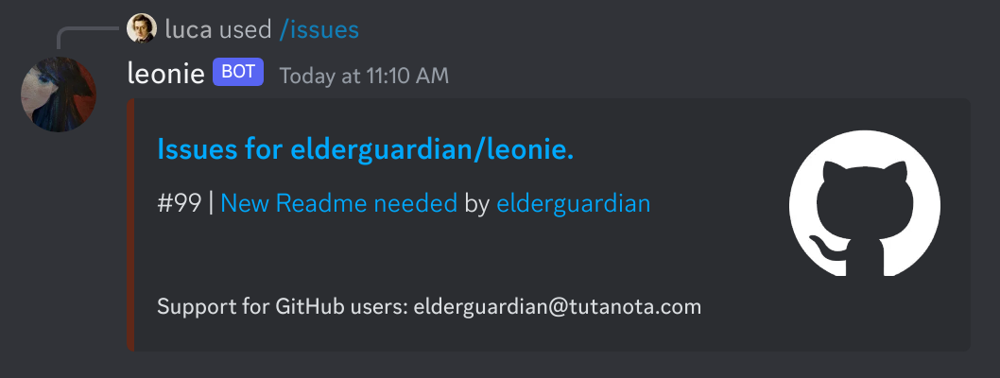

Come along on the journey of creating a command for  [Leonie](https://github.com/elderguardian/leonie) to display all [currently open issues](https://github.com/elderguardian/leonie/issues?q=is%3Aopen+is%3Aissue) in its repository.




<small>This article is about the implementation details of this feature, providing valuable insights into the usage of Leonie's unique and modular framework.</small>

## Creating a command
To implement the issue command in Leonie's framework, we start by creating an `IssueCommand.ts` file in the `commands/` directory. This file contains a Command Class that implements the `ICommand` interface.

```ts
export class IssuesCommand implements ICommand {
    getMetadata(): SlashCommandBuilder {
        return new SlashCommandBuilder()    
            .setName("issues")
            .setDescription("Get the current issues of this bot")
            .setDMPermission(true);
    }
    
    async run(runOptions: ICommandRunOptions, interaction: CommandInteraction): Promise<void> {
        //[...]
    }
}
```
This example command class defines an empty command. It includes basic metadata for Discord to recognize it as a slash command. The `SlashCommandBuilder` provided by [discord.js](https://discord.js.org/) follows the Object-Oriented Builder pattern; it should be self-explanatory in terms of usage.

## Fetching issues from GitHub
To retrieve the issues from GitHub, I built a component providing the `IGithubFetcher` interface and an implementation. I configured the DI mappings for it in `src/core/ioc/Container.ts`.

```ts
//[...]
    await interaction.deferReply(); // Tell Discord: Hey, Computing this might take a while.

    const githubFetcher = kernel.get(KernelMappings.GITHUB_FETCHER);
    const issues: RepositoryIssues = await githubFetcher.fetchIssues("elderguardian", "leonie");
    const openIssues = issues.filter((issue) => issue.state === "open");
//[...]
```

## Responding with the data
Now we have everything to complete this setup. Think of all scenarios: In case no issues are open, we will respond with an error.

```ts
//[...]
    if (openIssues.length === 0) {
        await interaction.editReply({
            content: "There are currently no open issues.",
        });
        return;
    }
//[...]
```

In case there are issues, we build an embed and send it to the user. For that, we will have to create readable strings containing the wanted information:

```ts
//[...]
    const embedDescription = openIssues
        .map((issue) => `#${issue.number} | [${issue.title}](${issue.url}) by [${issue.author.name}](${issue.author.url})`)
        .join("\n");
//[...]
```

Finally, we can send an embed in a nice format:
```ts
//[...]
    const issueEmbed = new EmbedBuilder()
        .setColor(leonieConfig.embed_color)
        .setTitle(`Issues for elderguardian/leonie.`)
        .setURL("https://github.com/elderguardian/leonie/issues")
        .setDescription(embedDescription)
        .setFooter({ text: 'Support for GitHub users: elderguardian@tutanota.com' });

    await interaction.editReply({ embeds: [issueEmbed] });
//[...]
```

## Registering the Commands
Remember to register your commands on Discord before running the command using `npm run register-commands`.