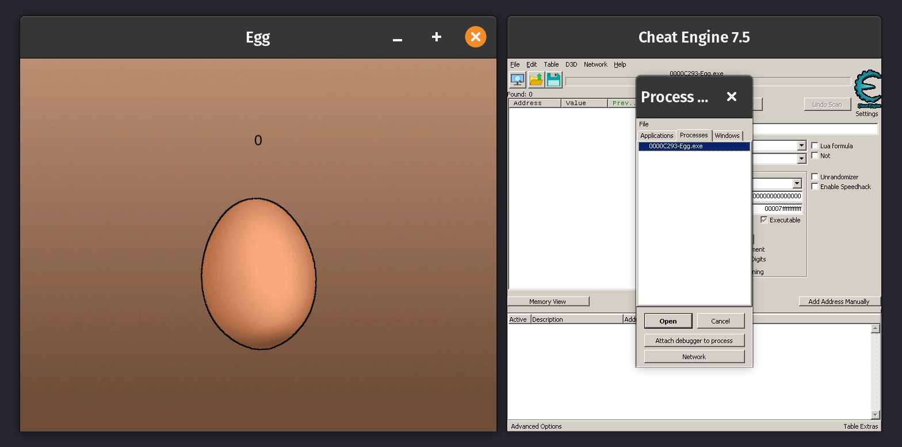
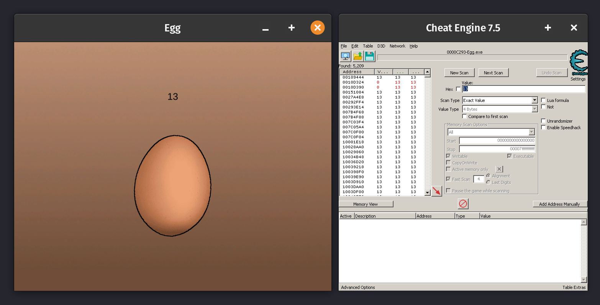
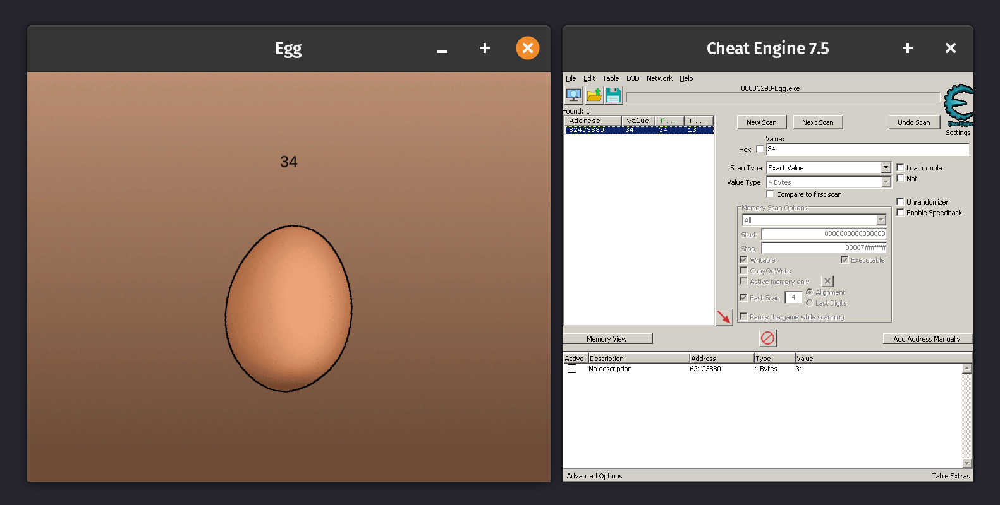
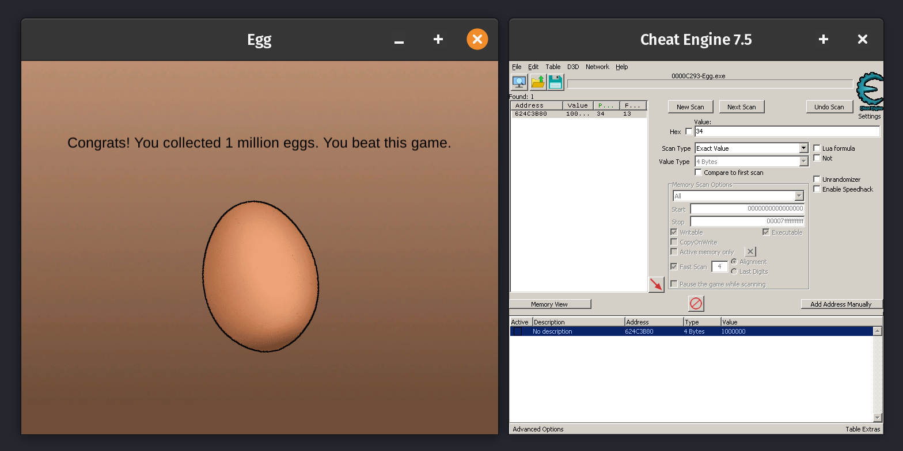

The Egg Game is a game where you have to click on an egg.
You win by clicking on it 1 million times.
This guide will show you how to quickly cheat your way to victory.
This method is very quick (5 minutes or so) and does not require you to use some weird program that takes 3 hours to auto click to the win.

## Setting up the environment
Install [Cheat Engine](https://www.cheatengine.org/) or another memory editor of your choice (e.g., [PINCE](https://github.com/korcankaraokcu/PINCE)).
Open the Egg Game, your memory editor, and attach it to the games process.

> You can actually use Cheat Engine on Linux with Wine (`wine <file>.exe`).
> To attach to a process, install and run the CEServer Software on your machine and connect to it from Cheat Engine running in wine.

## Finding the score address

We will be editing the value of the address referencing the game's score variable.
To find the score address, you can use the "Value" type and search for the current score.
Click the egg a few times and do another scan for the new score. Do this until you have one address left.

<small>First scan for 13 with a lot of results</small>

<small>Multiple scans later only one address is left</small>

## Editing the Value

Double-click the address to move it down to the footer section
and double-click the score value to edit the value. A window will pop up.
Set the new value to 999999 and click on "OK".
Now your game's score should update. Click the egg once, and you've completed it successfully.

