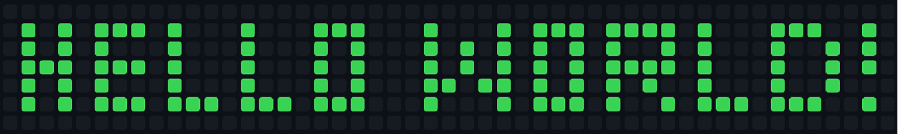
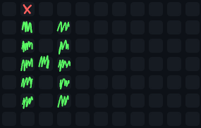
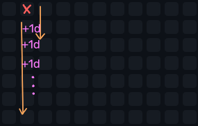

This guide will show you how to write text onto the contribution graph. In this example, I will push "Hello World!" into the year of my birth.

<br><br>

## Representing the Contribution Graph
The simplest way to represent the contribution graph is with a 2D array. 
I wrote that out manually, feel free to contact me if you wrote a tool for that.

<small>In this example, we are going to use Node.JS. Feel free to use something else.</small>

```js
const data = [
    [0, 0, 0, 0, 0, 0, 0, 0, 0, 0, 0, 0, 0, 0, 0, 0, 0, 0, 0, 0, 0, 0, 0, 0, 0, 0, 0, 0, 0, 0, 0, 0, 0, 0, 0, 0, 0, 0, 0, 0, 0, 0, 0, 0, 0, 0, 0],
    [1, 0, 1, 0, 1, 1, 1, 0, 1, 0, 0, 0, 1, 0, 0, 0, 1, 1, 1, 0, 0, 0, 1, 0, 0, 0, 1, 0, 1, 1, 1, 0, 1, 1, 1, 1, 0, 1, 0, 0, 0, 1, 1, 1, 0, 0, 1],
    [1, 0, 1, 0, 1, 0, 0, 0, 1, 0, 0, 0, 1, 0, 0, 0, 1, 0, 1, 0, 0, 0, 1, 0, 1, 0, 1, 0, 1, 0, 1, 0, 1, 0, 0, 1, 0, 1, 0, 0, 0, 1, 0, 0, 1, 0, 1],
    [1, 1, 1, 0, 1, 1, 1, 0, 1, 0, 0, 0, 1, 0, 0, 0, 1, 0, 1, 0, 0, 0, 1, 0, 1, 0, 1, 0, 1, 0, 1, 0, 1, 1, 1, 1, 0, 1, 0, 0, 0, 1, 0, 0, 1, 0, 1],
    [1, 0, 1, 0, 1, 0, 0, 0, 1, 0, 0, 0, 1, 0, 0, 0, 1, 0, 1, 0, 0, 0, 1, 1, 0, 1, 1, 0, 1, 0, 1, 0, 1, 0, 1, 0, 0, 1, 0, 0, 0, 1, 0, 0, 1, 0, 0],
    [1, 0, 1, 0, 1, 1, 1, 0, 1, 1, 1, 0, 1, 1, 1, 0, 1, 1, 1, 0, 0, 0, 1, 0, 0, 0, 1, 0, 1, 1, 1, 0, 1, 0, 0, 1, 0, 1, 1, 1, 0, 1, 1, 1, 0, 0, 1],
    [0, 0, 0, 0, 0, 0, 0, 0, 0, 0, 0, 0, 0, 0, 0, 0, 0, 0, 0, 0, 0, 0, 0, 0, 0, 0, 0, 0, 0, 0, 0, 0, 0, 0, 0, 0, 0, 0, 0, 0, 0, 0, 0, 0, 0, 0, 0],
];

//1: Green
//0: Gray
```

## How to color a square
Coloring a square involves creating a commit corresponding to its date. To create a local repository, use `git init`.

```
$ GIT_COMMITTER_DATE="Thu Jan 1 12:00 1970" \
  git commit --date="Thu Jan 1 12:00 1970" \
  --no-edit --allow-empty -m "Hello World!"`
```
<small>(Do not execute this yet.)</small>

## How the writing process works
We will write a script to loop through a 2D array and make commits based on dates. I will use January 8, 2006, as a starting point because it is a Sunday in the first week of the year, giving a good alignment.

<br><br>

## Implementing it in Node.JS
It is finally time to code. Create some sort of date to start with. I adjusted mine by two hours because of my local timezone.

```js
const startDate = new Date("9 Jan 2006 02:00:0")
```

Now, we need to loop through every row and column. With each iteration, you will notice that a day has passed in the Contribution Graph.

<br><br>

```js
for (let i = 0; i < data[0].length; i++) {
    for (let j = 0; j < data.length; j++) {
        startDate.setDate(startDate.getDate() + 1)
    }
}
```

Before incrementing the date, get the current square, detect if you should commit, and execute the command from earlier using [child processes](https://nodejs.org/api/child_process.html).

```js
//[...]
        const value = data[j][i]

        if (value === 1) {
            const commandString = `GIT_COMMITTER_DATE="${startDate.toISOString()}" `
                + `git commit --date="${startDate.toISOString()}" `
                + `--no-edit --allow-empty -m "Hello World!"`
            exec(commandString)
        }

        startDate.setDate(startDate.getDate() + 1)
//[...]
```

## Push local repository to your Contribution Graph
Now, create a new repository on your code sharing platform of choice and copy its URL. Push the changes using this command:

```
$ git remote add origin <your-repo-url>
$ git branch -M main # you can also use master or something else
$ git push -u origin main # you can also use master or something else
```

## Repairing a messed up graph
If you want to retry, you can create an orphan branch to get rid of all the existing commits.

```
$ git checkout --orphan=clean

Do your thing and add a remote...

$ git branch -m main # you can also use master or something else
$ git push -u origin main # you can also use master or something else
```